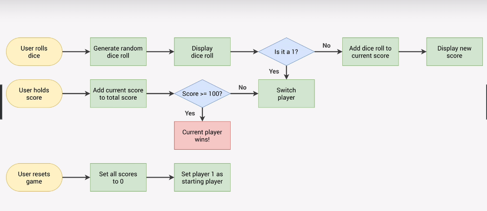

# Pig Game

This is a simple implementation of the Pig game in JavaScript. In this game, two players take turns rolling a dice and accumulating points. The goal is to be the first player to reach a score of 100 or more.

## How to Play

- Click the "Roll Dice" button to roll the dice.
- If you roll a 1, your current score is reset to 0, and it's the next player's turn.
- If you roll any other number, it's added to your current score.
- You can choose to "Hold" your current score, which adds it to your total score.
- The first player to reach a total score of 100 or more wins the game.
- Click the "New Game" button to start a new game.

Have fun playing the Pig game!

# Flowchart of the working BTS

